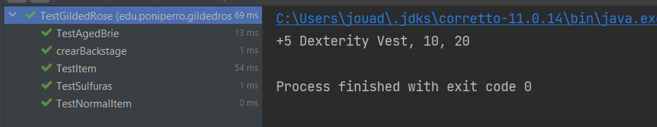

# Gilded Rose Kata 

Práctica de refactorizacion en java de Gilded Rose, pero incluyendo docker para la asignatura Sistemas informáticos.

---

## Funcionamiento y Diagrama UML

### Diagrama UML de la aplicación


### Casos test




### El resultado de la aplicación


---

## Docker

Nos encargamos de tener listo un *Dockerfile* y arrancamos, en este caso, una *Git Bash* desde ese directorio.

Ejecutamos:

``docker build -t gildedrose .``


En caso de que nos de error con la imagen, los siguientes comandos:

```export DOCKER_BUILDKIT=0```

```export COMPOSE_DOCKER_CLI_BUILD=0```


Para comprobar nuestros contenedores:


Ejecutamos 

``docker run -it --name katagildedrose gildedrose:latest``


En caso de instalar Maven


### Bibliografía:

Se ha usado *https://github.com/dfleta/docker-multistage-maven-java* como guía y recurso para el trabajo.